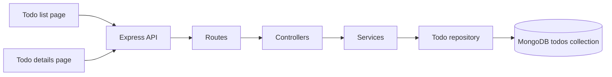

<p align="center">
  
</p>

<h1 align="center">ziptassk</h1>

<p align="center">A multi-page todo app with a small productivity dashboard.</p>

## About

Built for the Ziptrrip Tech challenge, ziptassk combines a React frontend with an Express API and MongoDB persistence. The app has separate todo list and todo details pages, with CRUD actions available across the two views.

## Features

- Create todos with a name and optional description using a single two-step input.
- Edit names inline on the list page and edit name, description, and deadline on the details page.
- Mark todos done or pending; completed names are shown with a strike-through.
- View individual todos at `/todo/?id=<todo-id>`.
- Delete an individual todo or reset the whole list.
- See completion progress, a live clock, a calendar, a motivational quote, and an embedded Spotify playlist.
- Teal branding, a light-only theme, and local logo/profile/plant images.
- Loading, empty, and API error states.

## Architecture

The backend follows a layered structure. Routes direct requests to controllers; controllers validate input and form responses; services coordinate todo operations; and the repository performs MongoDB access through Mongoose.



The frontend is a genuine Vite multi-page React application, not a single React app switching views by pathname. The root `index.html` mounts the todo list, while `todo/index.html` independently mounts the todo details page. The details page reads `id` from `/todo/?id=<todo-id>` and requests the selected item from `GET /api/todos/:id`. Navigation uses normal browser links between these documents.

The production build emits separate HTML documents:

```text
client/dist/
  index.html
  todo/index.html
  assets/...
```

## Run locally

You need Bun and a MongoDB connection string.

### 1. Start the backend

```bash
cd server
bun install
cp .env.example .env
```

Set `MONGODB_URI` in `server/.env`, then start the API:

```bash
bun run dev
```

The API listens on port `4000` by default. Set `PORT` in `server/.env` to use a different port.

### 2. Start the frontend

In another terminal:

```bash
cd client
bun install
cp .env.example .env
bun run dev
```

Open the local URL printed by Vite, usually `http://localhost:5173`. The frontend defaults to `http://localhost:4000/api`; set `VITE_API_URL` in `client/.env` if the API is hosted elsewhere.

## API

| Method | Endpoint | Description |
| --- | --- | --- |
| GET | `/health` | Check API availability |
| GET | `/api/todos` | List todos |
| GET | `/api/todos/:id` | Get one todo |
| POST | `/api/todos` | Create a todo |
| PATCH | `/api/todos/:id` | Update name, description, deadline, or completion |
| DELETE | `/api/todos/:id` | Delete a todo |

## Project layout

```text
client/                 React + TypeScript frontend
  index.html            Todo list HTML entry point
  todo/index.html       Todo details HTML entry point
  src/main.tsx          Todo list React entry point
  src/todo.tsx          Todo details React entry point
  src/                  Shared components, styles, and local assets
server/                 Express + TypeScript API
  src/routes/            HTTP route definitions
  src/controllers/       Request validation and responses
  src/services/          Todo application operations
  src/repositories/      MongoDB data access
  src/models/            Mongoose schemas and models
docs/FEATURES.md         Full feature list and architecture explanation
```

## Documentation

See [docs/FEATURES.md](docs/FEATURES.md) for the full feature description, page behavior, layered architecture, API details, and validation commands.
