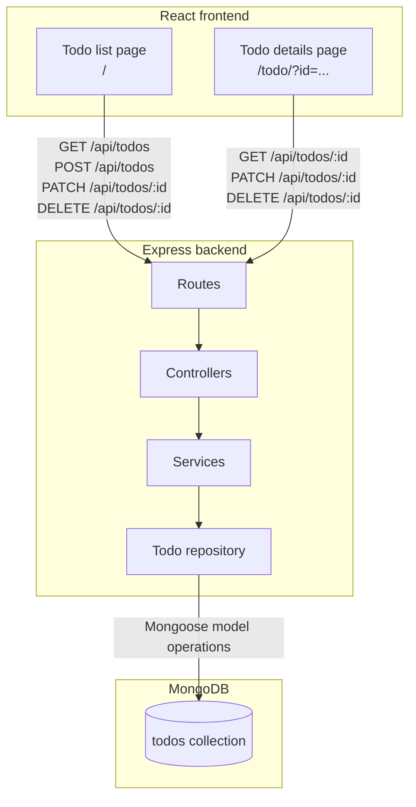

# ziptassk features

ziptassk is a multi-page todo application built for the Ziptrrip Tech challenge.

## Pages

- **Todo list**: `/` or `/index.html`. Loads todos from the backend, shows completion progress, and supports adding a todo name and optional description, completing, editing the name, viewing, deleting, and resetting todos.
- **Todo details**: `/todo/?id=<todo-id>`. This independently loaded React page reads the todo ID from the query string and fetches that todo from the backend. It displays its status, description, and deadline, and supports marking the todo done or pending, editing its name/description/deadline, and deleting it.

This is a genuine multi-page application: the todo list and todo details have separate HTML entry points (`index.html` and `todo/index.html`) and separate React entry modules (`src/main.tsx` and `src/todo.tsx`). It does not select views by pathname inside one React application. Normal browser links navigate between the documents, and either page can be opened directly. The Vite production build emits `dist/index.html` and `dist/todo/index.html`.

## System Architecture

ZipTassk uses a layered architecture. The React frontend communicates with the Express API over HTTP. The API separates request routing, request handling, application operations, and database access into distinct layers.



### Layer responsibilities

- **Frontend pages** render the todo list and individual todo details. They send API requests and display results or errors.
- **Routes** map HTTP methods and URL paths to controller functions.
- **Controllers** read request parameters and bodies, validate input, call services, and choose HTTP status codes and JSON responses.
- **Services** hold todo application operations and coordinate calls to the repository.
- **Repository** encapsulates MongoDB queries and writes through the Mongoose todo model, keeping database access out of services and controllers.
- **MongoDB** stores todo documents in the `todos` collection, including name, description, deadline, completion state, and timestamps.

For the details page, the browser URL uses the todo ID as a query parameter (`/todo/?id=...`). The frontend reads that ID and requests the backend resource at `/api/todos/:id`.

## Frontend functionality

- Create a todo with a generated deadline.
- Add an optional description when creating a todo.
- Use one two-step creation input: `Next` captures the name, then the same input accepts an optional description before `Add`.
- Toggle completion with persistent backend updates.
- Strike through completed todo names.
- Edit todo names.
- Edit from the main page with the same two-step name-then-description input flow.
- Edit todo descriptions and deadlines from the detail page.
- Delete individual todos.
- Delete a todo from its detail page with confirmation.
- Reset the complete list.
- Show loading, empty, and API error states.
- Show a calendar, live clock, quote, Spotify embed, and local illustrations.
- Use a light-only visual theme.

## Backend functionality

The Express API uses MongoDB through Mongoose and exposes:

| Method | Endpoint | Purpose |
| --- | --- | --- |
| GET | `/health` | Check API availability |
| GET | `/api/todos` | List todos |
| GET | `/api/todos/:id` | Get one todo |
| POST | `/api/todos` | Create a todo |
| PATCH | `/api/todos/:id` | Update name, description, deadline, or completion |
| DELETE | `/api/todos/:id` | Delete a todo |

## Local setup

```bash
cd server
bun install
cp .env.example .env
# Set MONGODB_URI in server/.env
bun run start
```

In another terminal:

```bash
cd client
bun install
cp .env.example .env
bun run dev
```

The client uses `VITE_API_URL` and defaults to `http://localhost:4000/api`.

## Validation

```bash
cd client && bun run build && bun run lint
cd ../server && bunx tsc --noEmit
```
